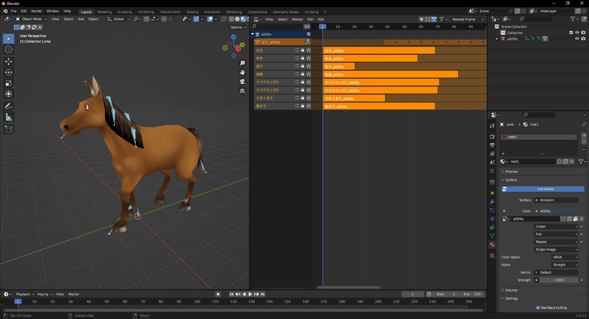

# DQ8 chr to glTF Converter


Convert Dragon Quest VIII (PS2) character models to modern 3D format.
A command-line tool for converting .CHR character model files from Dragon Quest VIII: Journey of the Cursed King (PlayStation 2) into glTF/GLB 3D formats for use in modern 3D applications, game engines, and viewers.


## Features

* Convert DQ8 **`.chr`** files to binary **`.glb`** (default) or text-based **`.glTF`** format.
* Convert **`.tm2`** textures to **`.png`** format.
* Read **`.mot`** motion files.
* Read **`info.cfg`** files to capture parameters of animation clips
* Batch processing of entire directories of character models.
* Raw asset extraction mode for research/modding purposes.
* Preserves original geometry, textures, and skeletal structure.

## Options

| Option | Description |
|--------|-------------|
| `-i`, `--input`   | Input path |
| `-o`, `--output`   | Output path |
| `-e`, `--extract`   | Extract only - unpack `.chr` without conversion |
| `-f`, `--format`   | Output format. `GLTF` for text format or `GLB` for binary (default: `GLB`) |
| `-b`, `--batch`   | Batch mode - process all `.chr` files in directory |
| `-h`, `--help`   | Show help |

## Usage

### Basic Syntax

```
dq8chr2glb.exe -i <input_file> -o <output_dir> [options]
dq8chr2glb.exe -i <input_dir> -b  # Batch mode
```

### Examples

```
dq8chr2glb.exe -i "C:\Games\DQ8\@DATA.DAT\chara\ap002.chr" -o "C:\Exports"
dq8chr2glb.exe -i "C:\Games\DQ8\@DATA.DAT\chara" -b
dq8chr2glb.exe -i "C:\Games\DQ8\@DATA.DAT\chara\ap002.chr" -o "C:\Exports" -e
dq8chr2glb.exe -i "C:\Games\DQ8\@DATA.DAT\chara" -b -t GLTF
```
